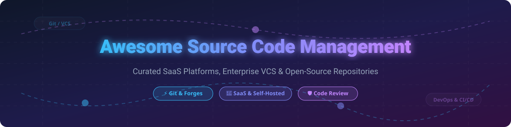

  

# 🚀 Awesome Source Code Management (SCM) Ecosystem 🛠️

  
  
  
  
  

> **A comprehensive, curated list of SaaS Source Code Management (SCM) platforms, self-hosted Git forges, Version Control Systems (VCS), enterprise code collaboration tools, and open-source GitHub repositories.**

**Last updated:** October 2026

---

## 📚 Table of Contents
- [🌐 SaaS / Hosted SCM Platforms](#-saas--hosted-scm-platforms)
- [🔓 Open-Source GitHub Projects](#-open-source-github-projects)
- [💡 How to Contribute](#-how-to-contribute)
- [⚠️ Disclaimer](#%EF%B8%8F-disclaimer)
- [💖 Support](#-support)
- [⭐ Star History](#-star-history)

---

## 🌐 SaaS / Hosted SCM Platforms

### 📈 Market Size & Industry Structure
> **Market Insights:** The global Source Code Management & DevOps market is estimated at **\$10.5 Billion+ (2026)** and is growing at ~18–20% CAGR. The sector is **highly concentrated (winner-take-most)**, dominated by Microsoft (GitHub, Azure DevOps) and GitLab, with specialized enterprise niches held by Atlassian (Bitbucket), AWS, and Perforce.

### 🏢 SaaS Platform Breakdown

| Rank | Platform | Company Size / Revenue / Valuation | Starting Paid Tier Pricing | Free Tier Limit | Description |
| :--- | :--- | :--- | :--- | :--- | :--- |
| **1** | 🐙 **[GitHub](https://github.com/)** | **\$3.2 Trillion** *(Microsoft Parent Market Cap; \$1B+ ARR)* | **\$4** per user/month (Team) | Unlimited public/private repos, 2,000 Actions CI/CD mins/mo, 500MB Packages storage, 120 Codespaces core-hours/mo | The world's largest Git hosting platform with 100M+ developers, native Actions CI/CD, and Copilot AI assistance. |
| **2** | ☁️ **[Azure Repos](https://azure.microsoft.com/en-us/products/devops/repos/)** | **\$3.2 Trillion** *(Microsoft Parent Market Cap)* | **\$6** per user/month (Azure DevOps Services) | 5 free users, 1,800 free CI/CD pipeline minutes/month (1 parallel job) | Microsoft's enterprise Git and TFVC hosting deeply integrated with Azure Pipelines, Boards, and Enterprise IAM. |
| **3** | 📦 **[AWS CodeCommit](https://aws.amazon.com/codecommit/)** | **\$1.9 Trillion** *(Amazon Parent Market Cap)* | **\$1** per active user/month (after 5 free users) | 5 active users/mo, 50 GB storage/mo, 10,000 Git requests/mo | AWS native Git hosting with AWS IAM access controls, KMS encryption, and seamless AWS cloud integrations. |
| **4** | 🔷 **[Bitbucket](https://bitbucket.org/)** | **\$48 Billion** *(Atlassian Market Cap)* | **\$3** per user/month (Standard tier) | 5 users, 50 GB storage, 500 Build minutes/month | Atlassian's Git solution featuring tight Jira, Confluence, and Trello integrations for software engineering workflows. |
| **5** | 🦊 **[GitLab](https://about.gitlab.com/)** | **\$8.5 Billion** *(Market Cap; \$600M+ ARR)* | **\$29** per user/month (Premium tier) | 5 users per private namespace, 400 compute CI/CD mins/mo, 10 GB project storage | Complete all-in-one DevOps platform combining SCM, CI/CD pipelines, security audits, and issue tracking. |
| **6** | ⚡ **[Perforce Helix Core](https://www.perforce.com/products/helix-core)** | **\$750 Million** *(Estimated Annual Revenue; PE Backed)* | **\$480** per user/year (Enterprise Tier) | Free for up to 5 users & 20 workspaces (Full enterprise features included) | Enterprise centralized version control optimized for massive binary assets, game engine assets (UE/Unity), and embedded hardware code. |
| **7** | 🔒 **[RhodeCode Enterprise](https://rhodecode.com/)** | **\$3.5 Million** *(Total Funding; ~\$3M ARR)* | **\$8** per user/month (Enterprise Edition) | 10 users free (Community Edition with multi-VCS support) | Unified enterprise source code management system supporting Git, Mercurial, and Subversion (SVN) under one management interface. |
| **8** | 🏺 **[SourceForge](https://sourceforge.net/)** | **Privately Held** *(BIXink / Slashdot Media)* | **Free / Ad-Supported** (Enterprise custom hosting) | Unlimited public open-source project hosting & distribution | Veteran code repository and software mirror distribution network active since 1999. |
| **9** | 🐘 **[Phabricator](https://phacility.com/phabricator/)** | **Discontinued** *(Upstream ended 2021)* | **N/A** (Legacy SaaS retired) | Open-source self-hosted code (Phacility hosted service closed) | Suite of open-source software development tools (Differential, Maniphest). Continued via community fork **Phorge**. |

---

## 🔓 Open-Source GitHub Projects

Below is a curated collection of top open-source Source Code Management repositories, Git web interfaces, code intelligence engines, and distributed version control systems, sorted by GitHub stargazers count:

- 🦊 **[GitLab Community Edition](https://gitlab.com/gitlab-org/gitlab)**  
    
  **The leading open-source DevOps platform.** MIT licensed core providing SCM, built-in CI/CD runners, container registry, and security auditing in a self-hosted stack.

- 🦔 **[Gitea](https://github.com/go-gitea/gitea)**  
    
  **Lightweight, ultra-fast Go Git service.** Features pull requests, wiki, issue tracker, and built-in Actions CI runner capable of running on minimal hardware like Raspberry Pi.

- 🐶 **[Gogs](https://github.com/gogs/gogs)**  
    
  **Painless self-hosted Git service written in Go.** Extremely low resource footprint, cross-platform deployment, and fast setup.

- 🔍 **[Sourcegraph](https://github.com/sourcegraph/sourcegraph)**  
    
  **Universal code search and code intelligence engine.** Enables cross-repository code navigation, structural search, dependency tracing, and automated batch changes.

- 📦 **[Git LFS](https://github.com/git-lfs/git-lfs)**  
    
  **Git Large File Storage extension.** Replaces large binary files, audio, video, and dataset assets with text pointers inside Git repositories.

- 🏰 **[Forgejo](https://codeberg.org/forgejo/forgejo)**  
    
  **Community-governed, non-profit fork of Gitea** hosted under Codeberg. Focused on software freedom, open governance, and vendor independence.

- ⚡ **[OneDev](https://github.com/theonedev/onedev)**  
    
  **All-in-one DevOps platform with Git management and visual CI/CD pipeline builder.** Single Java binary deployment with built-in Kubernetes support.

- 🌳 **[GitAhead](https://github.com/gitahead/gitahead)**  
    
  **Graphical user interface for Git repositories.** Cross-platform desktop client with native code diff viewer and repository management features.

- 🐍 **[Kallithea](https://github.com/kallithea/kallithea)**  
    
  **Open-source SCM supporting dual VCS engines (Git & Mercurial).** Python-based repository forge featuring fine-grained access control and code reviews.

- 🏛️ **[Phorge](https://we.phorge.it/)**  
    
  **Community-maintained open-source fork of Phabricator.** Includes Differential code review engine, Diffusion repository browser, and Maniphest ticket management.

- 📜 **[Savane](https://savannah.gnu.org/)**  
    
  **GNU Savannah web-based software hosting platform.** Powers official GNU free software hosting with support for Git, Subversion, CVS, and bug tracking.

---

### 🛠️ Core Version Control Engines & Legacy Tools
- ⚡ **Git** — *The foundational distributed version control system created by Linus Torvalds powering modern software development.*
- 🪶 **Mercurial** — *Distributed version control system engineered for high performance on large codebases.*
- 🐢 **Apache Subversion (SVN)** — *Enterprise centralized version control system designed for binary assets and legacy enterprise codebases.*
- 🦴 **CVS (Concurrent Versions System)** — *Pioneering centralized version control system, historically significant for early open-source projects.*
- 🦕 **Fossil** — *Distributed VCS created by SQLite authors containing integrated bug tracking, wiki, and web server in a single C binary.*

---

## 💡 How to Contribute

1. 🍴 **Fork** this repository.
2. 📝 Add or edit entries in `README.md` following the consistent markdown formatting.
3. 🔎 Include: Product Name, URL, concise description, starting price, and open-source license / hosting model.
4. 📬 Submit a **Pull Request (PR)** with a clear summary of changes.

---

## ⚠️ Disclaimer

- This repository is a **community-curated list** provided for informational and educational purposes.
- Features, storage quotas, and tier pricing for SaaS platforms are subject to change by vendor providers.
- Self-hosted SCM solutions require security audits, access control hardening, and reliable backup policies to protect code IP.

---

## 💖 Support

If you find this repository helpful, please consider supporting the project:

- ⭐ **Star** this repository to increase visibility!
- 🔀 **Fork** and contribute your favorite source code management tools.
- 📢 **Share** with your DevOps teams and developer friends.
- ☕ **Sponsor the Maintainer:** 

---

## ⭐ Star History

---

Made with ❤️ for developers, DevOps engineers, and open-source contributors worldwide.

